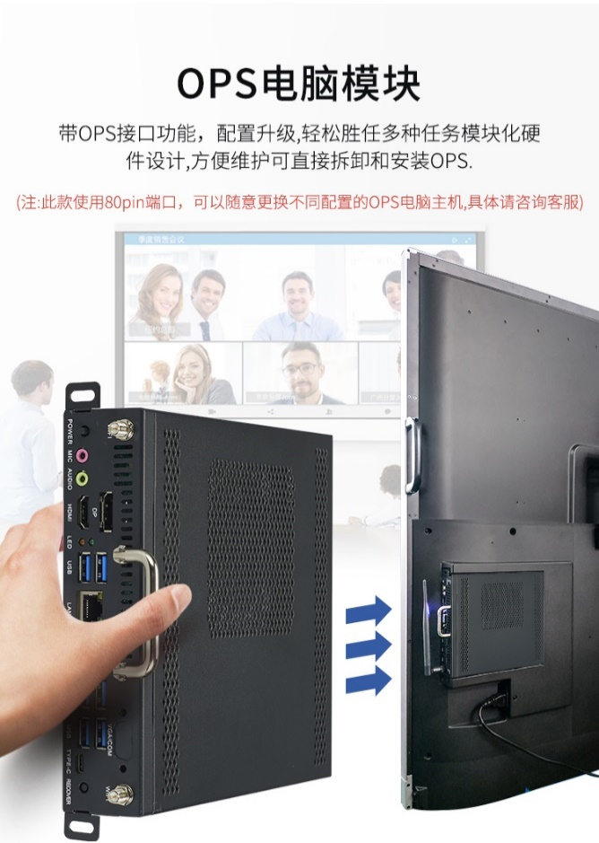

PC 模块是我们日常接触最多的部分。大部分的教学~~以及游戏~~工作都在 PC 模块中进行。

在大部分一体机中，PC 模块作为 OPS 主机插入到一体机中，并通过一体机的屏幕显示与触摸。

::: info
Open Pluggable Specification（OPS）是一种计算模块插件格式，旨在为类似希沃白板的平板显示器增加计算能力。该格式于 2010 年由 NEC（日本电气股份有限公司），Intel 和 Microsoft 首次公布。Intel 是 OPS 格式的牵头者之一，所以绝大多数计算模块都是在基于 Intel 的 CPU 上运行，运行的操作系统包括 Windows 和 Android。
:::

PC 模式下的一体机基本上就是一台带有触摸的 PC，功能与普通 PC 相差不大。其配置强弱由学校的资金是否雄厚来决定，一般是中低端 CPU + 亮机卡/核显 + 小厂 SSD。通过上图方式连接到 [Android 部分](android-part)，作为一个信号源输出视频信号。一体机上的 USB 接口所连接的设备、触摸屏的数据、遥控器的信号、都将经过 OPS 接口以 USB 协议传输至主机，而 OPS 的视频信号则通过 HDMi/DVI/DP 协议输出。希沃一体机自带了一个 Wi-Fi 网卡，在使用 PC 模块时，被识别为一个 USB 网卡。希沃一体机底部有一个 RJ45 网口，在 S75EB 上，其最大连接速率为 100Mbps。若你追求极致的上网速度，推荐将网线连接至 OPS 主机上的 RJ45 网口，其最大连接速率通常为 1000Mbps。

一般来说，希沃一体机自带的 PC 模块型号以 MT 开头。具体型号可使用 AIDA64 等软件查看。

在一体机中使用 OPS 的主要好处是：当 PC 模块发生故障时，更换模块非常容易，从而大大减少了停机时间。我们可以提前预备一些 OPS 主机，发生故障时，我们就可以快速的将正常的模块替换上去，将故障的模块带回到工作台上慢慢检修。不过遗憾的是，为了使黑板与教学一体机更加一体化，大多数教室都选择将机器嵌入到黑板当中。这种安装方式使得OPS易于维护的特性荡然无存。维护时，我们通常需要将黑板拆下，将一体机从电视挂架上取下，才能对相关硬件进行检修和替换。而且，虽然《规范》当中对可插拔模块的尺寸进行了规定，但在实际市场中，各配件的厚度并没有统一。所以，对于特定机型，仍需要购买其定制的OPS模块。

当然，如果你对一体性要求不高，对高价低配的 OPS 模块嗤之以鼻，你也可以考虑给一体机外接 PC，事实上，也确实有厂家已经生产出来了相应的产品。以希沃一体机为例：我们只需要将一体机侧边的 HDMI 接口以及 TOUCH 接口用线缆连接到外置 PC 上，再在希沃白板上选择对应的 HDMI 信号源，即可获得和 OPS 同样的体验。
